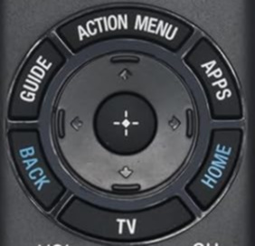
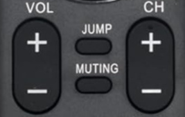
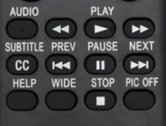

# Sony_Remote_Infrared_Hack
Sony Remote Infrared Hack — Capture, decode, analyze, and transmit Sony TV remote IR commands using Arduino.


```
https://robu.in/product/hx1838-vs1838-nec-infrared-ir-wireless-remote-control-sensor-module-arduino/
https://robu.in/product/arduino-nano-board-3-0-with-ch340-chip-unsoldered/
https://www.amazon.in/RMF-TX310U-Replace-Voice-Remote-Control/dp/B07ZSW42RZ

https://robu.in/product/nrf51822-ble4-0-bluetooth-2-4g-wireless-module-onboard-rev3/
```


### CHIP

```


N51822   ???    nRF51822 multi-protocol ZBluethooth Low Energy And 2.4GHz RF system-On-Chip 

20-pin STM microcontrollers   32F033F


```

### POWER

- **Protocol:** Sony
- **Address:** `0x01`
- **Command:** `0x15`
- **Raw Data:** `0x095`
- **Bits:** 12
- **Bit Order:** LSB First
- **Gap:** `3,276,750 µs` (~3.277 s)
- **Duration:** `18,950 µs` (~18.95 ms)


```
                 Sony IR frame
                       │
             ┌─────────┴─────────┐
             │                   │
         Address              Command
          0x01                  0x15
             │                   │
             └─────────┬─────────┘
                       │
                  Encoded into
                       │
                    Raw Data
                     0x095
                       │
                    12 bits

```


## Sony TV IR Commands


|----| Img | Button | Address | Command | Raw Data | Bits |
|----|----------------------------------|-----------------|-------:|---:|---:|---:|
|1|   | POWER           | `0x01` | `0x15` | `0x095`  | 12   |
|2|   | SPEECH          | -----  | -----  | -----    | -----|
|3|   | SOURCE          | `0x01` | `0x25` | `0xA5`   | 12   |
|4|   | MENU            | `0xC4` | `0x49` | `0x6249` | 12   |
|-|   | ---             | ---    | ---    | ---      | ---  |
|-|   | ---             | ---    | ---    | ---      | ---  |
|5|   | DIGITAL/ANALOG  | `0x77` | `0xD`  | `0x3B8D` | 12   |
|-|  -----------------------------------| ------------    | ---    | ---    | ---      | ---  |
|6|   | 1               | `0x1`  | `0x0`  | `0x80`   | 12   |
|7|   | 2               | `0x1`  | `0x1`  | `0x81`   | 12   |
|8|   | 3               | `0x1`  | `0x2`  | `0x82`   | 12   |
|9|   | 4               | `0x1`  | `0x3`  | `0x83`   | 12   |
|10|  | 5               | `0x1`  | `0x4`  | `0x84`   | 12   |
|11|  | 6               | `0x1`  | `0x5`  | `0x85`   | 12   |
|12|  | 7               | `0x1`  | `0x6`  | `0x86`   | 12   |
|13|  | 8               | `0x1`  | `0x7`  | `0x87`   | 12   |
|14|  | 9               | `0x1`  | `0x8`  | `0x88`   | 12   |
|15|  | DOT             | `0x1`  | `0x3A` | `0xBA`   | 12   |
|16|  | 0               | `0x1`  | `0x9`  | `0x89`   | 12   |
|17|  | DISPLAY         | `0x1`  | `0x3F` | `0xBF`   | 12   |
|-|  -----------------------------------| ------------    | ---    | ---    | ---      | ---  |
|18|  | GOOGLEPLAY      | `0xC4` | `0x46` | `0x6246` | 15   |
|19|  | NETFLIX         | `0x1A` | `0x7C` | `0xD7C`  | 15   |
|-|  -----------------------------------| ------------    | ---    | ---    | ---      | ---  |
|-|   | LEFT 2 RIGHT    | ---    | ---    | ---      | ---  |
|20|  | RED             | `0x97` | `0x25` | `0x4BA5` | 15   |
|21|  | GREEN           | `0x97` | `0x26` | `0x4BA6` | 15   |
|22|  | YELLOW          | `0x97` | `0x27` | `0x4BA7` | 15   |
|23|  | BLUE            | `0x97` | `0x24` | `0x4BA4` | 15   |
|-|  -----------------------------------| ------------    | ---    | ---    | ---      | ---  |
|24|  | GUIDE           | `0xA4` | `0x5B` | `0x525B` | 15   |
|25|  | ACTION MENU     | `0xC4` | `0x4B` | `0x624B` | 15   |
|26|  | APPS            | `0xC4` | `0x2A` | `0x622A` | 15   |
|27|  | HOME            | `0x1`  | `0x60` | `0xE0`   | 12   |
|28|  | TV              | `0x1`  | `0x24` | `0xA4`   | 12   |
|29|  | BACK            | `0x97` | `0x23` | `0x4BA3` | 15   |
|30|  | LEFT    ARROW   | `0x1`  | `0x34` | `0xB4`   | 12   |
|31|  | RIGHT   ARROW   | `0x1`  | `0x33` | `0xB3`   | 12   |
|32|  | TOP     ARROW   | `0x1`  | `0x74` | `0xF4`   | 12   |
|33|  | BOTTOM  ARROW   | `0x1`  | `0x75` | `0xF5`   | 12   |
|34|  | CENTER          | `0x1`  | `0x65` | `0xE5`   | 12   |
|-|  -----------------------------------| ------------    | ---    | ---    | ---      | ---  |
|35|  | VOLUME UP       | `0x1`  | `0x12` | `0x92`   | 12   |
|36|  | VOLUME DOWN     | `0x1`  | `0x13` | `0x93`   | 12   |
|37|  | LOOP            | `0x1`  | `0x3B` | `0xBB`   | 12   |
|38|  | MUTE            | `0x1`  | `0x14` | `0x94`   | 12   |
|39|  | PROG  +         | `0x1`  | `0x10` | `0x90`   | 12   |
|40|  | PROG  -         | `0x1`  | `0x11` | `0x91`   | 12   |
|-|  -----------------------------------| ------------    | ---    | ---    | ---      | ---  |
|41|  | AUDIO           | `0x1`  | `0x17` | `0x97`   | 12   |
|42|  | BACKWARD        | `0x97` | `0x1B` | `0x4B9B` | 15   |
|43|  | PLAY            | `0x97` | `0x1A` | `0x4B9A` | 15   |
|44|  | FORWARD         | `0x97` | `0x1C` | `0x4B9C` | 15   |
|45|  | SUBTITLE        | `0x97` | `0x28` | `0x4BA8` | 15   |
|46|  | BACK NEXT       | `0x97` | `0x3C` | `0x4BBC` | 15   |
|47|  | PAUSE           | `0x97` | `0x19` | `0x4B99` | 15   |
|48|  | FORWARD NEXT    | `0x97` | `0x3D` | `0x4BBD` | 15   |
|49|  | HELP            | `0xC4` | `0x4D` | `0x624D` | 15   |
|50|  | EXIT            | `0x1`  | `0x63` | `0xE3`   | 12   |
|51|  | STOP            | `0x97` | `0x18` | `0x4B98` | 15   |
|52|  | SYNC MENU       | `0x1A` | `0x58` | `0xD58`  | 15   |


### Help

```
https://blog.flipper.net/infrared/
https://www.youtube.com/watch?v=XUY0-doBx1U


https://github.com/marsfan/IR-Codes/tree/master
```