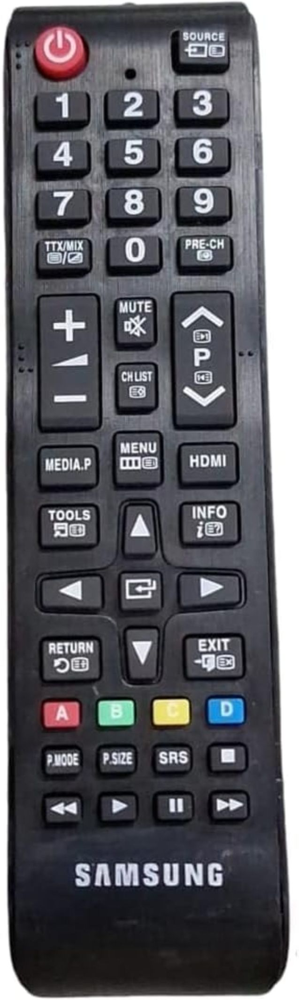

## Sony TV IR Commands

  

|----| Img | Button | Address | Command | Raw Data | Bits |
|----|----------------------------------|-----------------|-------:|---:|---:|---:|
|1 |  | POWER           | `0x7`  | `0x2`  | `0xFD020707`   | 32   |
|2 |  | SOURCE          | `0x7`  | `0x1`  | `0xFE010707`   | 32   |
|3 |  | 1               | `0x7`  | `0x4`  | `0xFB040707`   | 32   |
|4 |  | 2               | `0x7`  | `0x5`  | `0xFA050707`   | 32   |
|5 |  | 3               | `0x7`  | `0x6`  | `0xF9060707`   | 32   |
|6 |  | 4               | `0x7`  | `0x8`  | `0xF7080707`   | 32   |
|7 |  | 5               | `0x7`  | `0x9`  | `0xF6090707`   | 32   |
|8 |  | 6               | `0x7`  | `0xA`  | `0xF50A0707`   | 32   |
|9 |  | 7               | `0x7`  | `0xC`  | `0xF30C0707`   | 32   |
|10|  | 8               | `0x7`  | `0xD`  | `0xF20D0707`   | 32   |
|11|  | 9               | `0x7`  | `0xE`  | `0xF10E0707`   | 32   |
|12|  | TTX/MIX         | `0x7`  | `0x2C` | `0xD32C0707`   | 32   |
|13|  | 0               | `0x7`  | `0x11` | `0xEE110707`   | 32   |
|14|  | PRE-CH          | `0x7`  | `0x13` | `0xEC130707`   | 32   |
|15|  | +               | `0x7`  | `0x7`  | `0xF8070707`   | 32   |
|16|  | -               | `0x7`  | `0xB`  | `0xF40B0707`   | 32   |
|17|  | MUTE            | `0x7`  | `0xF`  | `0xF00F0707`   | 32   |
|18|  | CH LIST         | `0x7`  | `0x6B` | `0x946B0707`   | 32   |
|19|  | UP P            | `0x7`  | `0x12` | `0xED120707`   | 32   |
|20|  | DOWN P          | `0x7`  | `0x10` | `0xEF100707`   | 32   |
|21|  | CONTENT         | `0x7`  | `0x0`  | `0x5B3C93DC`   | 32   |
|22|  | MENU            | `0x7`  | `0x1A` | `0xE51A0707`   | 32   |
|23|  | HDMI            | `0x7`  | `0x8B` | `0x748B0707`   | 32   |
|24|  | TOOLS           | `0x7`  | `0x4B` | `0xB44B0707`   | 32   |
|25|  | INFO            | `0x7`  | `0x1F` | `0xE01F0707`   | 32   |
|26|  | RETURN          | `0x7`  | `0x58` | `0xA7580707`   | 32   |
|27|  | EXIT            | `0x7`  | `0x2D` | `0xD22D0707`   | 32   |
|28|  | LEFT    ARROW   | `0x7`  | `0x65` | `0x9A650707`   | 32   |
|29|  | RIGHT   ARROW   | `0x7`  | `0x62` | `0x9D620707`   | 32   |
|30|  | TOP     ARROW   | `0x7`  | `0x60` | `0x9F600707`   | 32   |
|31|  | BOTTOM  ARROW   | `0x7`  | `0x61` | `0x9E610707`   | 32   |
|32|  | CENTER          | `0x7`  | `0x68` | `0x97680707`   | 32   |
|33|  | A               | `0x7`  | `0x6C` | `0x936C0707`   | 32   |
|34|  | B               | `0x7`  | `0x14` | `0xEB140707`   | 32   |
|35|  | C               | `0x7`  | `0x15` | `0xEA150707`   | 32   |
|36|  | D               | `0x7`  | `0x16` | `0xE9160707`   | 32   |
|37|  | E-MANUAL        | `0x7`  | `0x3F` | `0xC03F0707`   | 32   |
|38|  | P.SIZE          | `0x7`  | `0x3E` | `0xC13E0707`   | 32   |
|39|  | 3D              | `0x7`  | `0x9F` | `0x609F0707`   | 32   |
|40|  | STOP            | `0x7`  | `0x46` | `0xB9460707`   | 32   |
|41|  | BACK NEXT       | `0x7`  | `0x45` | `0xBA450707`   | 32   |
|42|  | PLAY            | `0x7`  | `0x47` | `0xB8470707`   | 32   |
|43|  | PAUSE           | `0x7`  | `0x4A` | `0xB54A0707`   | 32   |
|44|  | FORWARD NEXT    | `0x7`  | `0x48` | `0xB7480707`   | 32   |
|-|  -----------------------------------| ------------    | ---    | ---    | ---      | ---  |

